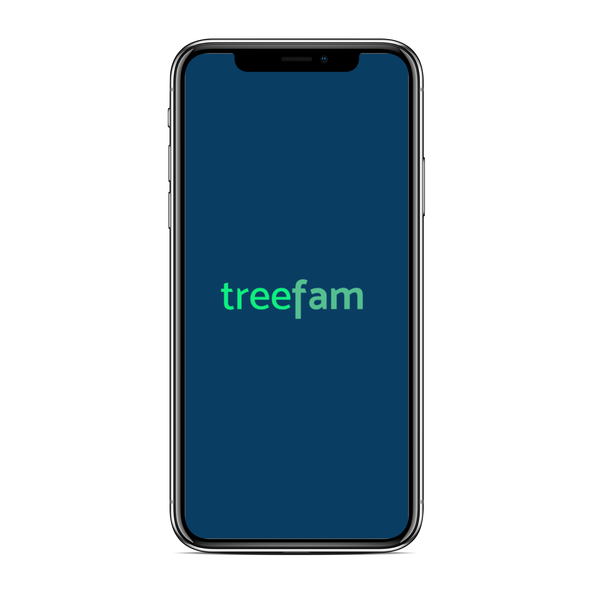
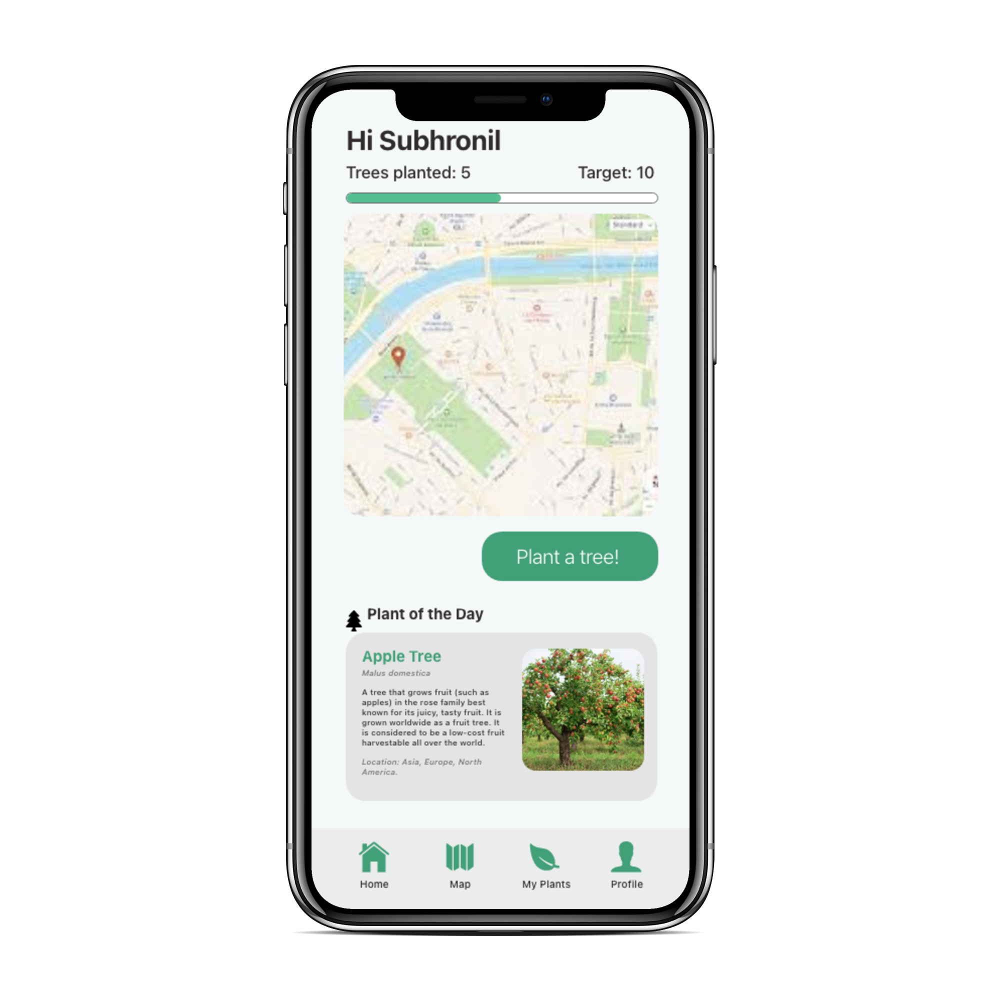

# Ivyhacks 2020 Submission: TreeFam

Submission for IvyHacks 2020. (Social Good)

Youtube Demo: https://www.youtube.com/watch?v=3aQ-GjwDVVk

TreeFam is a community for nature lovers. Keep track of how many trees you plant, get points and also see your friends stats!

## Inspiration

The inspiration for this project came from an incident that I witnessed a few days back. A few woodcutters who claimed to be from my local municipality came around our apartment and were about to chop down a massive tree that was in front of our building. My mother who is strictly against chopping down trees saw them in action and decided to confront them. They stated that a branch was going over our neighbor's fence and they wanted it removed. What they were about to do is chop the whole tree down, and also had orders from municipality people. My mom was very much against this, especially when the problem could be solved just by trimming a branch. 

So, that made me wonder about the sheer number of people who still do not seem to understand the impact of deforestation, even after massive forest fires in the Amazon, wildfires in California, and Australia which broke out just this year, wiping out large covers of flora and fauna.   

In the first seven months of 2020, more than 13,000sq km (5,019sq miles) of the Brazilian Amazon was burned, according to the analysis of satellite data provided by Dr. Michelle Kalamandeen, a tropical ecologist on the Amazon rainforest. That's more than eight times the size of London, according to a BBC report.

This gave me the idea of a social app that encourages you to plant trees, using a points system. You are encouraged to plant a tree near your own residence, or anywhere else, and when you do, you receive climate points. You can also see your friends' climate points. It would give you inspiration and help you feel like a responsible adult helping tackle climate change. 

## What it does

It keeps track of how many plants you and your friends plant and gives you points.

## How I built it

I built it using React.js for the web, using Firebase for authentication, and Google Maps API for keeping track of where you are planting your trees.

## Challenges I ran into

Integrating Google Maps API was new to me. Initially, I thought of building a mobile app with Flutter, but since I was new to the framework and ran into some problems I decided to go with building a web app.

## What's next for TreeFam

- It has to be able to support multiple users. Not yet.
- A Computer Vision model can be implemented to detect the kinds of plants in your neighborhood if you do not know, so you can take care of them better.
- Providing a list of suggested plants species to sow in your backyard using an API.
